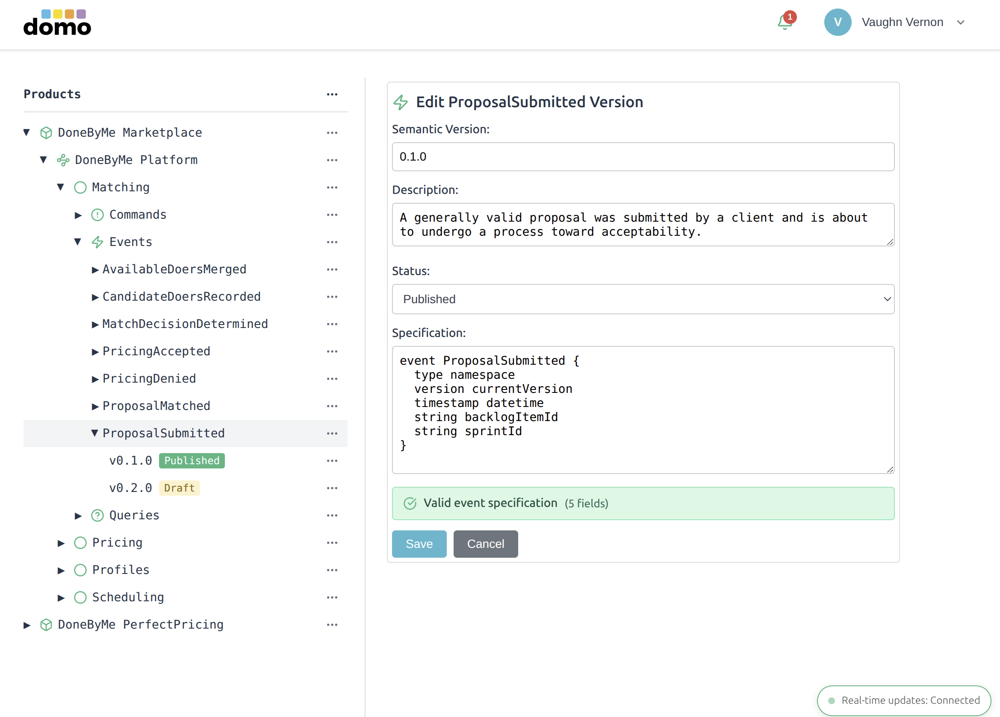

# Domo Schema Minder: A Schema Registry

This product is for experimental purposes. I used Claude Code to design and implement all of the source code and much of the documentation. Minimal code was written manually. I did write, rearrange, and format a significant amount of the user documentation. Yet, it is incomplete given the most recent features and functionality.

I think that the schema registry product is useful, but its main purpose is for exploration. I have purposely limited some of the features and the registry lacks plugin extensibility.

Much of the tool's functionality resides in the browser client. There is no explicit domain model and the serverless functions primarily support CRUD persistence and support data updates via broadcasting through WebSockets.

The cloud platform is Cloudflare with a single Durable Object backed by SQLite. A Durable Object is essentially a Cloudflare Worker with a D1 database. Ultimately, there would be one Durable Object per tenant, and thus each tenant would have an isolated SQLite database instance. I have deployed to Cloudflare, but I have primarily run locally in developer mode.

All benefits of serverless apply as well as platform limitations, such as maximum size of the Durable Object SQLite database, which is currently 10 GB.

## Guide

| What                    | Where                                    |
--------------------------|------------------------------------------|
| Getting Started         | `docs/GETTING_STARTED.md`                |
| Claude Code Guidance    | `./CLAUDE.md`                            |
| Developer Documentation | `./docs`                                 |
| Source Code             | `./src`                                  |
| Tests                   | `./tests`                                |
| User Documentation      | `./docs/user/KaleleDomoSchemaMinder.md`  |
| License (MPL 2)         | `./LICENSE`                              |
