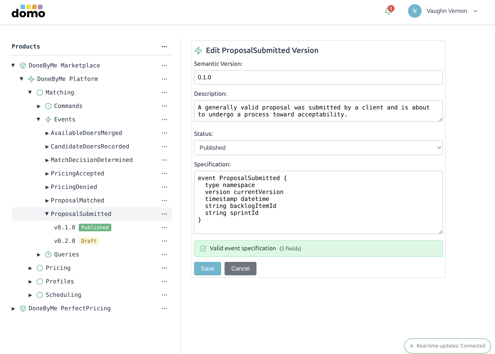
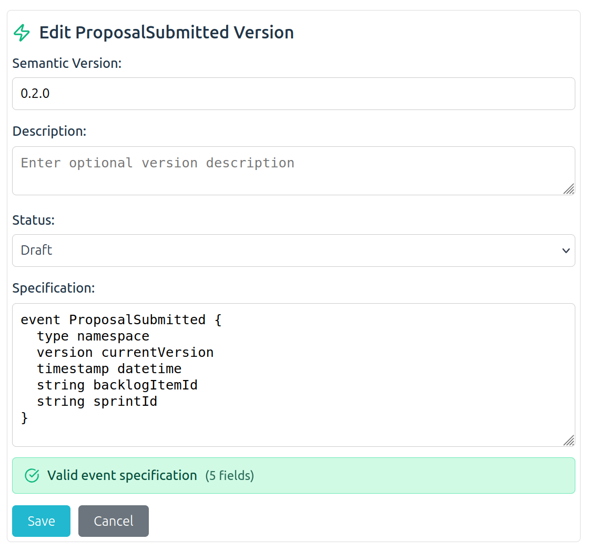

# Kalele Domo Schema Minder

## Overview

Kalele Domo Schema Minder is a schema registry service that contains and manages schema life cycles and dependencies for applications and service-based architectures. Type schema types include commands, data, documents, envelopes, events, and queries. The Schema Minder provides a central repository for schema definitions, versioning, and compatibility management across distributed systems.


<center><small><b><em>Domo Schema Minder user interface</em></b></small></center>
<br>

Further, Schema Minder offers the means for *Bounded Contexts,* à la services or smallish application subsystems, to publish standard types that are made available to dependent Bounded Contexts as client services. The published standard types are known as schemas, and the registry hosts the schemas for given product and domain as well as the services within. When published as official system-wide integration "language," the collective set of schemas are known as a *Published Language.*

One of the big challenges with exchanging information (knowledge) across Bounded Contexts, implemented as microservices and monolithic applications, is when changes to the information structure, data types, and attribute/property types and names, cause incompatibilities for the dependents. Experience proves that such changes are infrequently known to consuming dependents. When that is the case, essential integrations break down.


<center><small><b><em>Bounded Contexts exchanging a Published Language</em></b></small></center>
<br>

Another challenge is maintaining type safety of the exchanged information across Bounded Contexts when a consumer deserializes (or unmarshals) data from the exchange format into a local object. Further, various Bounded Contexts may be implemented in a number of different programming languages, and the process of deserializing is tedious or impossible due to incompatibilities in formats between producer and consumer data types.

Schema Minder provides the means to eliminate such problems and minimize challenges by maintaining semantic versioning across the range of standard type schemas. This tool also facilitates consumer build dependencies on the schema types according to the local programming language.

## Published Language

Schema Minder supports what is know in Domain-Driven Design (DDD) as the Published Language. If you have any of Vaughn Vernon's DDD and DDD-related books, you can read more about Published Language in those. Still, we provide a basic overview of its uses here.


<center><small><b><em>Events of a Published Language of a Context inside a Product and a Domain</em></b></small></center>
<br>


A few very important points in conjunction with developing a Published Language are,

1. A Published Language should not be directly related to the internal domain model of your Bounded Context, and the internal domain model of your Bounded Context should not depend on the types defined in your Published Language. The types defined in your Published Language may be fundamentally the same or similar, but they are not the same things. Separate the two.

2. A Published Language is used for presenting API types and data in an open and well-documented way. These are used by clients to communicate with a Bounded Context, and for a Bounded Context to communicate with client services outside its boundary.

3. Your domain model is more closely tied to the concepts learned and discovered by your team that are related to its shared mental model and specific Ubiquitous Language. A Published Language is driven by the needs of Bounded Contexts (clients, or otherwise collaborating/integrating applications and services) outside your Bounded Context that needs to use data to communicate and/or understand the outcomes that your Bounded Context produces. Your Published Language should be based on your Ubiquitous Language, but it may not (and often should not) share everything about its internal structure, typing, and data.

4. There is a Context Mapping strategic design pattern of DDD known as Conformist. Closely related to the previous point #3, the goal of Published Language is to prevent collaborating/integrating Bounded Contexts (clients, or otherwise collaborating or integrating applications and services) from being required to conform to your internal domain model and be affected by its ongoing changes. Instead, consumers would adhere to a common standard Published Language, or even translate from a standard Published Language into their own Ubiquitous Language.

5. If collaborators/integrators did conform directly to your Ubiquitous Language, every change in your domain model would ripple into their external Bounded Contexts, having negative maintenance impacts. There are times when being a Conformist can be advantageous. It requires less conceptual design to adhere to another model, but with less flexibility in your Context. In such cases, data types used by conforming collaborators/integrators can likewise be defined inside Schema Minder. Even so, here  focus is given to the more inviting and flexible Published Language.

### Note

One exception to the strong suggestion for your domain model to not consume types from your Published Language may be with your Domain Events. It may make sense to use these in your domain model because it can reduce the amount of mapping between Domain Events defined in your domain model and those used for persistence and messaging, for example. Still, sharing types could be problematic and good judgment should be used in deciding whether or not to do so. This is generally a trade-off in the development overhead of maintaining separate types and mapping them, and reducing the runtime overhead of mapping between types and the memory management garbage that this produces.

## Use Cases

The following reviews some typical use cases that are supported by the Published Language. There may be concepts and schema structuring that are unfamiliar, but any such will be explained soon. It's most important that you now understand why Schema Minder exists and why it is used.

1. A client sends a Command request to a Bounded Context. The client must communicate that request using types and data that the Bounded Context understands. The Bounded Context defines a schema inside Schema Minder such as: `Org.Unit.Context.Commands.DoSomethingForMe`. That Command has some data structure, such as for the REST HTTP request body payload, or for a message payload if using messaging.
2. A client sends a Query request to a Bounded Context. For example, a client sends a `GET` request using REST over HTTP. The Bounded Context must respond with a result, and the `200 OK` response body definition is defined as a Document. That Document result is defined in Schema Minder and may have a name in the following format: `Org.Unit.Context.Documents.TypeThatWasQueried`.
3. After use case #1 above completes, the Bounded Context emits a Domain Event. The type and data of that outgoing Domain Event is defined in Schema Minder and may have a name in the following format: `Org.Unit.Context.Events.SomethingCompleted`.
4. It is possible that any one of #1, #2, and/or #3 use additional complex data types within their definition. These additional complex data types would be defined by the Bounded Context under `Org.Unit.Context.Data`, perhaps as `Org.Unit.Context.Data.SomethingDataType`.
5. It is possible (even likely) that any one of #1, #2, and/or #3, if based on messaging (or possibly even REST), will define one or more types within `Org.Unit.Context.Envelope`, such as `Org.Unit.Context.Envelope.Notification`. Such an Envelope type "wraps" a Command, a Document, and/or a Domain Event, and is used to communicate metadata about the incoming Command or the resulting Document and published Domain Event.
6. The publisher of a schema can require changes to it. The clients/consumers could fail to correctly consume the exchanged information due to being uninformed about the changes. To protect against such failures, Schema Minder disallows breaking changes based on semantic versions that expressly assert compatibility must be maintained. All breaking changes must be made only using the next highest major version. To use the minor or patch version requires non-breaking changes.
7. The teams working in a given Bounded Context are free to choose whichever programming language and technology stack they deem best for their work. When any Bounded Context must consume information from any other, each could use a different language and set of technologies. The publisher of a schema and any consumers must be able to exchange the information in a type-safe manner even when language and technologies differ. Schema Minder facilitates generating consumer-side types based on a language-neutral format.

The functionality that accommodates these use cases is described next.

## Concepts and Design

The Schema Minder presents the following basic logical interface and hierarchy:

```
Product
  Domain
    Context
      Commands
        Schema
          SchemaVersion (Version, Status, Specification)
          ...
        ...
      Data
        Schema
          SchemaVersion (Version, Status, Specification)
          ...
        ...
      Documents
        Schema
          SchemaVersion (Version, Status, Specification)
          ...
        ...
      Envelopes
        Schema
          SchemaVersion (Version, Status, Specification)
          ...
        ...
      Events
        Schema
          SchemaVersion (Version, Status, Specification)
          ...
        ...
      Queries
        Schema
          SchemaVersion (Version, Status, Specification)
          ...
        ...
```
<center><small><b><em>Schema Minder Hierarchy: Product / Domain / Context / {Category} / Schema / Schema Versions </em></b></small></center>
<br>

From the top of the hierarchy the nodes are defined as follows.

**Product**: The top-level division. This may be the name of software product or overarching project. That is the vision behind the design. Alternatively, if your organization is a project consulting firm, it could be the name of your client/customer's company, and/or the name of a prominent business division within a company. If there is only one company using this registry then the Product could be a major division within the implied company. There may be any number of such defined, but there must be at least one.

**Domain**: The second-level division. This is intended to serve as the name of a primary business domain within the Product (or other top-level entity). Otherwise, if the organization is a business division then the Domain may serve as a department or team within a business division. Note that there is no reasonable limit on the name of the Domain, so it may contain dot notation in order to provide additional organizational levels. In an attempt to maintain simplicity we don't want to provide nested Domains because the Domains themselves can become obsolete with corporate and team reorganizations. It's best to name a Domain according to some non-changing business function rather than physical departments.

**Context**: The logical application or (micro)service within which schemas are to be defined and for which the schemas are published to potential consumers. You may think of this as the name of the Bounded Context, and it may even be appropriate to name it the top-level namespace used by the Context, e.g. `com.saasovation.agilepm`. Within each Context there may be a number of category types used to describe its Published Language served by its Open-Host Service. Currently these include: Commands, Data, Documents, Envelopes, Events, and Queries. Some of the parts are meant to help define other parts, and so are building blocks. Other parts are the highest level of the Published Language. These are called out in the following definitions.

**Commands**: This is a top-level schema type where Command operations, such as those supporting CQRS, are defined by schemas. If the Context's Open-Host Service is REST-based, these would define the payload schema submitted as the HTTP request body of POST, PATCH, and PUT methods. If the Open-Host Service is an asynchronous-message-based mechanism (e.g. RabbitMQ or Kafka), these would define the payload of Command messages sent through the messaging mechanism.

**Data**: This is a building-block schema type where general-purpose data records, structures, or objects are defined and that may be used inside any of the other schema types (e.g. type Token). You may also place metadata types here (e.g. type Metadata or more specifically, type CauseMetadata).

**Documents**: This is a top-level schema type that defines the full content payload of document-based operations, such as the query results of CQRS queries. These documents are suitable for use as REST response bodies and messaging mechanism payloads.

**Envelopes**: This is a building-block schema type meant to define the few number of message envelopes that "wrap" message-based schemas. When sending any kind of message, such as Command messages and Event messages, it is common to "wrap" these in an Envelope that defines some high-level metadata about the messages being sent by a sender and being received by a receiver. The term "wrap" in double quotes indicates that the structure may not actually be used to hold a message type, but rather serve as a header messages. This might be HTTP headers or a header type required by the message types defined by a message broker or bus product.

**Events**: This is a top-level schema type that conveys the facts about happenings within the Context that are important for other Context's to consume. These are known as Domain Events but may instead be categorized as Business Events. The reason for the distinction is that some individuals consider Domain Events to be internal-only events; that is, those events only of interest to the owning Context. Those holding that viewpoint think of events of interest outside the owning Context as Business Events. To avoid any confusion the term Event is used for this schema type and may be used to define any event that is of interest either inside or outside the owning Context, or both inside and outside the owning Context.

**Queries**: This building-block schema type is intended to be used by external consumers of your service or application to query your Context through an Open-Host Service. This type may hold specific query access information as well as query parameters. It could be useful as an abstraction that could be applied equally over RESTful HTTP, including GraphQL, messaging mechanisms, gRPC, and others.

**Schema**: Under every top-level schema category (or type, such as Commands and Events) are any number of Schema definitions. Besides a category, a Schema has a name and description. Every Schema has at least one Schema Version, which holds the actual Specification. Additional schema versions may be derived from the original or make a clean break from its predecessors. Thus, the Schema itself is a container for an ordered collection of Schema Versions that each have a Specification.

**Schema Version**: Every Schema has at least one Schema Version, and may have several versions. A Schema Version holds the Specification of a particular version of the Schema. In addition, it also holds a Description, a Semantic Version number, and a Status. The Description is a textual/prose description of the purpose of the Schema Version.

**Specification**: A Schema Version's Specification is a textual external DSL (a code block of a Domain-Specific Language) that declares the data types and shape of the Schema at a given version. If a new version falls within the same major version as from the one it is derived, its Specification must be backward compatible with previous version. The DSL is shown in detail below.

**Semantic Version**: A semantic version is a three-part version, with a major, minor, and patch value, with each subsequent version part separated by a dot (decimal point), such as `1.2.3` for example. Here `1` is the major version, `2` is the minor version, and `3` is the patch version. If any two Schema Versions share the same major version then it is required that their Specifications be compatible with each other. Thus, the newer version, such as `1.2.0`, must be compatible with the Specification of `1.1.3`, and `1.1.3` must be compatible with `1.2.0`. On the other hand, version `2.0.0` can be incompatible with version `1.2.0` and any other predecessors. To break free from required compatibility, change in major version to make necessary incompatible changes. When `2.0.0` becomes the published production version, all dependents must have upgraded to safely consume it.

**Status**: The Status of a Schema Version has four possible values: `Draft`, `Published`, `Deprecated`, and `Removed`.
- A `Draft` is intended for use by initial definition of any version. As such, the Specification is unofficial and may change. Dependents may still use a `Draft` status Schema Version for test purposes, but with the understanding that the Specification may change at any time.
- When a Schema Version is considered production-ready, its status is upgraded to `Published`. Marking a Schema Version as `Published` is performed manually by the Context team after it has satisfied its own and its consumer dependency requirements.
- When your team decides to transition from one Schema Version to another, you might want to mark the old version as `Deprecated`, which causes a warning when that version is consumed.
- If, for some reason, it is necessary to forever remove a Schema Version, it can be marked as `Removed`. It may then still be viewed but not used by the owning Context or consuming integrators of the Context.

### Note

Both `Deprecated` and `Removed` statuses cause its fields to be frozen, except that `Deprecated` may be transitioned to `Removed` as a final step.

Both `Deprecated` and `Removed` can be "restored" only by defining a new Schema Version with its specification. So, the Schema Version is not restored, but replaced by a new definition of the same.

To prevent accidentally marking a Schema Version `Deprecated` or `Removed`, an alert dialog warns the user and requires them to confirm the action.

## Key Features

- **Hierarchical Organization**: Organize schemas in a Product → Domain → Context hierarchy
- **Multiple Schema Types**: Support for Commands, Data, Documents, Envelopes, Events, and Queries
- **Semantic Versioning**: Full semantic versioning support with compatibility checking
- **Schema Life Cycle**: Manage schema changes while maintaining backward/forward compatibility
- **Real-time Collaboration**: Multiple users can work simultaneously with broadcast updates to all other live users of the same registry
- **DSL Specification**: Simple domain-specific language for schema definitions

## Presentation

The Schema Minder user interface is organized for ease of browsing and navigation by hierarchy, finding exact and similar searched text, filtering by status, and for reading schemas, their versions, and for defining new ones.


<center><small><b><em>Hierarchical navigation leads to viewing a Schema Version</em></b></small></center>
<br>

### Logical Hierarchy

Schema Minder organizes schemas in a four-level hierarchy:

1. **Product** - The top-level product, possibly with specific organizational responsibility
    - *represents software systems* using one product per major system or application; emphasizes product-level care
2. **Domain** - Business domains within a product
    - *follows business capabilities* that align with your business architecture
3. **Context** - Bounded contexts within a domain
    - *asserts boundaries* that keep related schemas together
4. **Schema** - Schema categories and individual schema definitions within a context
   - **Schema Versions** - Versioned specifications of each schema

### Schema Categories

Within each context, schemas are organized by category:

- **Commands** - Messages that express intentions to perform actions
- **Data** - Data structures and value objects
- **Documents** - Document schemas for structured content
- **Envelopes** - Message wrappers and metadata containers
- **Events** - Messages that record facts about what has occurred
- **Queries** - Messages that request information from the system

### Looking Inside

The UI provides a tree view used to browse the available data and a view for each level in the hierarchy described above: Organizations, Units, Contexts, Schemas and Schema Versions. These are accessible via the menu to the left. We also have Dark Mode (top-right).

#### Expanding and Collapsing Tree Branches

Schema Minder provides efficient navigation of large hierarchies through smart expand/collapse functionality:

*Basic Navigation:*
- **Click** any Product, Domain, Context, or Schema to toggle expand/collapse of just that single item
- Expansion arrows appear next to expandable items to indicate their current state

*Expand/Collapse All Descendants (Shift+Click):*
For rapid exploration or cleanup of the tree view, use **Shift+Click** on any of these levels:
- **Product**: Shift+Click to expand/collapse all domains, contexts, schema categories, schemas, and versions underneath
- **Domain**: Shift+Click to expand/collapse all contexts, schema categories, schemas, and versions underneath
- **Context**: Shift+Click to expand/collapse all schema categories, schemas, and versions underneath
- **Schema Category** (e.g., "Events"): Shift+Click to expand/collapse all schemas and versions in that category

*How Shift+Click Works:*
- If the item is **collapsed**: Shift+Click expands it and ALL descendants (Expand All)
- If the item is **expanded**: Shift+Click collapses it and ALL descendants (Collapse All)

This toggle behavior makes it easy to:
- Quickly explore an entire product's schema hierarchy with one Shift+Click
- Clean up the view by collapsing large expanded sections
- Focus on specific areas while hiding others
- Navigate efficiently through deep hierarchies without clicking each level individually

*Example Usage:*
1. To see everything in a product at once: Shift+Click the collapsed product name
2. To hide a large expanded section: Shift+Click the expanded product/domain/context
3. To explore all schemas in a context: Shift+Click the collapsed context name
4. To quickly close all schemas in a category: Shift+Click the expanded category name

#### Viewing Schema Details

You can browse existing Schema Versions by navigating into the hierarchy. Once you've selected the version you're interested in, you can:

- Review its description and change it
- Review its specification
- Update its specification as long as the Schema Version is still in Draft status
- Transition between the four life cycle states Draft, Published, Deprecated and Removed, unless it's already


<center><small><b><em>Editing a Schema Version</em></b></small></center>
<br>

### Real-time Collaboration

Schema Minder supports real-time collaboration:

- Multiple users can work simultaneously
- Changes are instantly synchronized to all other current users
- Connection status indicator at the lower right shows real-time sync status
- Forms displaying the version just changed by another use auto-update when changes are saved to the backing data storage

*[UI Screenshot Placeholder: Real-time Collaboration Indicators]*

## Working in the Registry

Users are offered reasonable defaults to quickly get started with Schema Minder.

### Creating Your First Schema

Upon your first use of Schema Minder, there is a default, precreated hierarchy:

- My Product
  - My Domain
    - My Context

These can be renamed and described by using the menu to the far right of each item. The menu access is displayed as ... and has options in addition to Edit. Edit is used to change the names and descriptions of the initial hierarchy and other items as the registry is further populated over time.

To establish a new hierarchy, the following shows the steps involved in defining one Product containing one Domain with a single Context. Once this is done, Schemas and their Schema Versions can be defined within a Context.

*Define a New Product*

First, use the menu to the right of the Products label at the top left to select the New Product option. The following form opens to the right of the tree view.


<center><small><b><em>Defining a new Product</em></b></small></center>
<br>

*Define a New Domain*

When the new Product exists, use the menu to its right to select the New Domain option. The following form opens to the right of the tree view.


<center><small><b><em>Defining a new Domain</em></b></small></center>
<br>

*Define a New Context*

Content...

*[UI Screenshot Placeholder: Defining elements: Context WITH NAMESPACE]*

*Define a New Schema*

To create concrete specifications (in Schema Versions), you'll first need to define the Schema meta data. You can choose among all the Schema categories. When defining a Schema, it is recommended to use an initial capital letter, and use Pascal (mixed) case to separate words (e.g. `SomethingDefined`). The following is an example form:


<center><small><b><em>Defining a new Schema</em></b></small></center>
<br>

Note that when you select New Schema from the from an existing category type, the Schema type category is already selected. In the above example, the New Schema option was selected from the Commands category menu and thus has the Command schema category pre-selected as the default. This can still be changed, but it is likely that New Schema was selected from a given type category for a reason.

Also note that in a new Schema definition you will enter the initial semantic version, status, and specification, which becomes the Schema's first Schema Version. So, you are actually defining a new Schema and Schema Version in one step. All subsequent Schema Versions are defined by starting from an existing Schema Version.

*Define a New Schema Version*

When defining a new Schema Version from a preexisting one, we suggest to always keep semantic versions in order and without version gaps. Schema Minder automatically generates a suggested semantic version from the one being derive, and based on the next available version within the same major version:


<center><small><b><em>Defining a new Schema Version</em></b></small></center>
<br>

The user can override the suggested semantic version if necessary, but it is almost certainly correct. A comment is inserted into the bottom of the inherited specification. It reminds the user that a change made in a new minor version should be based on additive-only edits, which will endure compatibility across minor versions.

```
event ProposalSubmitted {
  type namespace
  version currentVersion
  timestamp datetime
  string backlogItemId
  string sprintId
  string[] progress
  // TODO: for compatibility, make additive-only changes
}
```

Given that there must be only new fields added to the end of the previous specification, this excludes such edits that would break consumers of the previous minor version. Thus, the following changes cannot be made in a new minor version:

- Field type
- Field name
- Deleting a field
- Reordering fields

The simplest way to ensure only compatible changes is to replace the `TODO` comment with one or more completely new fields. In some cases, you might add a new field that replaces an existing field by type and obviously by name, but retains the old name.


```
event ProposalSubmitted {
  type namespace
  version currentVersion
  timestamp datetime
  string backlogItemId
  string sprintId
  string[] progress // retained for backward compatibility
  data.ProgressType[] progessTypes
}
```

For consumers who don't need the changed type, the pre-existing one can still be used (or safely ignored as before).

With that knowledge, it's important to understand the Schema specification language grammar. Don't worry. It's quite simple and likely already very familiar.

## Schema Specification Grammar

The following is the schema specification:

```
{typeName} {schemaName} {
  type schemaTypeNameAttribute
  version versionAttribute
  timestamp timestampAttribute

  boolean booleanAttribute (= true)?
  boolean[] booleanArrayAttribute (= { true, false, true })?
  byte byteAttribute (= 0)?
  byte[] byteArrayAttribute (= { 0, 127, 65 })?
  char charAttribute (= 'A')?
  char[] charArrayAttribute (= { 'A', 'B', 'C' })?
  double doubleAttribute (= 1.0)?
  double[] doubleArrayAttribute (= { 1.0, 2.0, 3.0 })?
  float floatAttribute (= 1.0)?
  float[] floatArrayAttribute (= { 1.0, 2.0, 3.0 })?
  int intAttribute (= 123)?
  int[] intArrayAttribute (= { 123, 456, 789 })?
  long longAttribute = 7890
  long[] longArrayAttribute (= { 7890, 1234, 5678 })?
  short shortAttribute (= 32767)?
  short[] shortArrayAttribute (= { 0, 1, 2 })?
  string stringAttribute (= "abc")?
  string[] stringArrayAttribute (= { "abc", "def", "ghi" })?
  SchemaName schemaAttribute1
  SchemaName[] schemaArrayAttribute1
  category.SchemaName schemaAttribute2
  category.SchemaName:1.2.1 schemaAttribute3
  category.SchemaName:1.2.1[] schemaArrayAttribute4
}
```

Default values are optional and may or may not be set. Valid tokens inside the `()?` capturing group are used to optionally set values. The values used above are only examples. Approprate valid values are to be used.

## Data Type Definitions

### Core Type Attributes/Properties

**DataType: `{typeName}`**

This must be replaced by one of the concrete category types: `command`, `data`, `document`, `envelope`, `event`, or `query`. In this example, the first token of each specification is the typeName:

```
command CommitBacklogItem {
  // ...
}

event BacklogItemCommitted {
  // ...
}

query GetBacklogItem {
  // ...
}
```

**DataType: `schemaName`**

The name of the schema being specified. In this example, the second token of each specification is the schemaName:

```
command CommitBacklogItem {
  // ...
}

event BacklogItemCommitted {
  // ...
}

query GetBacklogItem {
  // ...
}
```

### Special Attributes

**DataType: `schemaTypeName`**

The fully-qualified schema name to be included in the message itself with the given attribute name. This would generally be implemented by a string type of a given concrete programming language. (Note that this may be used instead on the a typeName of envelope.) Example:

```
command CommitBacklogItem {
  type eventTypeName
  // ...
}

event BacklogItemCommitted {
  type commandTypeName
  // ...
}
```

**DataType: `version`**

The datatype specifically defining that the semantic version of the given Schema Version should be included in the message itself with the given attribute name and would generally be implemented by a string type of a given concrete programming language. Example:

```
command CommitBacklogItem {
  version currentVersion
  // ...
}

event BacklogItemCommitted {
  version currentVersion
  // ...
}
```

**DataType: `timestamp`**

The datatype specifically defining that the timestamp of when the given instance was created to be included in the message itself with the given attribute name, which would generally be implemented by a long integer type or a string type of a given concrete programming language. Example:

```
command CommitBacklogItem {
  timestamp submittedAt
  // ...
}

event BacklogItemCommitted {
  timestamp occurredOn
  // ...
}
```

### Primitive Types

**DataType: `boolean`**

The boolean datatype, with values of true or false only, to be included in the message with the given attribute name. This value may be defaulted if the declaration is followed by an equals sign and a true or false:

```
event BacklogItemCommitted {
  // ...
  boolean planned
}
```

**DataType: `boolean[]`**

The boolean array datatype with multiple values of true and false only:

```
event UsersVoted {
  // ...
  boolean[] commonVotes = { true, false, true }
}
```

**DataType: `byte`**

The 8-bit signed byte datatype with values of -128 to 127:

```
event UserSelected {
  // ...
  byte shortcutValue = 65
}
```

**DataType: `byte[]`**

The 8-bit signed byte array datatype:

```
event MachineDataDefined {
  // ...
  byte[] defaultValues = { 1, 12, 123 }
}
```

**DataType: `char`**

The char datatype with values supporting UTF-8:

```
event UserSelected {
  // ...
  char shortcut = 'A'
}
```

**DataType: `char[]`**

The char array datatype with multiple UTF-8 values:

```
event DocumentStyleDefined {
  // ...
  char[] headingTypes = { '#', '##', '###' }
}
```

**DataType: `double`**

The double-precision floating point datatype:

```
event ExpectedAnswersDefined {
  // ...
  double valueOfPi = 3.1416
}
```

**DataType: `double[]`**

The double-precision floating point array datatype:

```
event FlowMeasurementsCaptured {
  // ...
  double[] commonTargetFlowUnits = { 0.00223, 0.00221, 0.00442 }
}
```

**DataType: `float`**

The single-precision floating point datatype:

```
event ExpectedAnswersDefined {
  // ...
  float valueOfPi = 3.14
}
```

**DataType: `float[]`**

The single-precision floating point array datatype:

```
event PollCompleted {
  // ...
  float[] possibleValues = { 1.54, 3.92, 1.88, 2.47 }
}
```

**DataType: `int`**

The 32-bit signed integer datatype with values of -2,147,483,648 to 2,147,483,647:

```
event TrafficCounted {
  // ...
  int yearEndTotal
}
```

**DataType: `int[]`**

The 32-bit signed integer array datatype:

```
event TrafficCounted {
  // ...
  int[] sampleRange = { 518279, 400131 }
}
```

**DataType: `long`**

The 64-bit signed integer datatype with values of -9,223,372,036,854,775,808 to 9,223,372,036,854,775,807:

```
event TrafficCounted {
  // ...
  long tensYearsTotal
}
```

**DataType: `long[]`**

The 64-bit signed integer array datatype:

```
command InitializeDistances {
  // ...
  long[] values = { 15329885886279, 24389775639272, 45336993791291 }
}
```

**DataType: `short`**

The 16-bit signed integer datatype with values of -32,768 to 32,767:

```
data DefaultValues {
  // ...
  short defaultUnreceivedReading = 12986
}
```

**DataType: `short[]`**

The 16-bit signed integer array datatype:

```
data DefaultValues {
  // ...
  short[] defaultUnreceivedReadings = { 12986, 3772, 10994 }
}
```

**DataType: `string`**

The string datatype with values supporting multi-character UTF-8 strings:

```
data LanguageSamples {
  // ...
  string englishAlphabetRepresentation = "ABC"
}
```

**DataType: `string[]`**

The string array datatype:

```
data FunnyLyrics {
  // ...
  string[] soundOfMusic = { "Doe", "Ray", "Me" }
}
```

### Complex Types

**DataType: `SchemaName`**

The explicit name of the complex Schema type without a Category reference, which implies that it must be within the same Category as the referencing type. It must be found in the current Context. The version is the tip (most recent version):

```
data FullName {
  string givenName
  string secondName
  string familyName
}

data ContactInformation {
  FullName fullName
  // ...
}
```

**DataType: `{schemaTypeCategory}.{schemaName}`**

The explicit complex Schema type of a given Category. It must be found in the current Context:

```
data FullName {
  string givenName
  string secondName
  string familyName
}

event UserRegistered {
  type schemaTypeName
  version currentVersion
  timestamp datetime
  data.FullName fullName
  // ...
}
```

**DataType: `{schemaTypeCategory}.{schemaName}[]`**

The explicit complex Schema type array of a given Category:

```
data Telephone {
  string number
}

event PersonDefined {
  type schemaTypeName
  version currentVersion
  timestamp datetime
  data.Telephone[] telephones
  // ...
}
```

**DataType: `{schemaTypeCategory}.{schemaName}:1.2.3`**

The explicit complex Schema type with a specific version:

```
// Schema Version: 1.1.0 with country code
data Telephone {
  string number
  string countryCode
}

event PersonDefined {
  type schemaTypeName
  version currentVersion
  timestamp datetime
  data.Telephone:1.1.0 telephone
  // ...
}
```

**DataType: `{schemaTypeCategory}.{schemaName}:1.2.3[]`**

The explicit complex Schema type array with a specific version:

```
// Schema Version: 1.1.0 with country code
data Telephone {
  string number
  string countryCode
}

event PersonDefined {
  type schemaTypeName
  version currentVersion
  timestamp datetime
  data.Telephone:1.1.0[] telephones
  // ...
}
```

### More About Type Literal Syntax

The following are the rules for value literals of both single primitives and arrays of primitives.

Each type is preceded by the following comment format for a single primitive type:

```
// Type: type-name Value Range: value-literal to value-literal
```

 > NOTE: boolean has no range; only true or false

Or for a primitive type array:

```
// Type: type-name array
```

An array may have values of the same value range as the single primitive with the option of multiple such value literals separated by commas.

To declare the value literal for any type, use the syntax: equal sign (`=`) followed by the literal value to set the variable, as indicated here:

type variable-name = value-literal

The outter `()?` indicates that setting a default value is optional:

```
(= literal-value)?
```

For an array literal, there are `{` and `}` characters that surround a comma-separated list of primitive value literals. The `[, ...]` indicates that additional primitive values are optional:

```
(= { literal-value1[, ...] })?
```

This is the list of types with literals:

```
// Type: boolean Values: true or false
boolean booleanAttribute (= true)?

// Type: boolean array
boolean[] booleanArrayAttribute (= { true, false, true })?

// Type: byte array Value Range: -128 to 127
byte byteAttribute (= 0)?

// Type: byte array
byte[] byteArrayAttribute (= { 0, 127, 65 })?

// Type: char array Values: 'c' where c is any UTF-8 character
char charAttribute (= 'A')?

// Type: char array
char[] charArrayAttribute (= { 'A', 'B', 'C' })?

// Type: double Value Range: -1.7976931348623157E+308 to 1.7976931348623157E+308
double doubleAttribute (= 1.0)?

// Type: double array
double[] doubleArrayAttribute (= { 1.0, 2.0, 3.0 })?

// Type: float Value Range: -1.4E-45 to 3.4028235E38
float floatAttribute (= 1.0)?

// Type: float array
float[] floatArrayAttribute (= { 1.0, 2.0, 3.0 })?

// Type: int Value Range: -2,147,483,648 to 2,147,483,647
int intAttribute (= 123)?

// Type: int array
int[] intArrayAttribute (= { 123, 456, 789 })?

// Type: long Value Range: -9,223,372,036,854,775,808 to 9,223,372,036,854,775,807
long longAttribute = 7890

// Type: long array
long[] longArrayAttribute (= { 7890, 1234, 5678 })?

// Type: short Value Range: -32,768 to 32,767
short shortAttribute (= 32767)?

// Type: short array
short[] shortArrayAttribute (= { 0, 1, 2 })?

// Type: string array Value Range: A string of 1 to 64 UTF-8 characters
string stringAttribute (= "abc")?

// Type: string array
string[] stringArrayAttribute (= { "abc", "def", "ghi" })?
```

## Working with Schema Specifications and Schema Dependencies

Schema Minder provides an HTTP API and a web user interface. Both can be used to manage master data, like organizations and units, as well as schema definitions. Typically, you'll use the GUI to edit master data and browse existing schemata and the API to integrate schema registry interactions with your development tooling and build pipelines.

### Editing Schema Elements

Assuming the Schema Version is still a Draft, you may review and change any editable elements in the Schema Version. Following any edits, use the Save button to store the changes. You may revert the changes by clicking the Cancel button.

*[UI Screenshot Placeholder: Editing a Schema Version]*

### TODO: Viewing Source Code

To view a Schema Version's source code generated from the specification, click on the Code button.

*[UI Screenshot Placeholder: View generated source code]*

### Publishing a Schema Version

When defining a new version of an existing schema, the specification is validated with regard to the new semantic version according to the following rules:

- New patch version (e.g. 1.2.5 to 1.2.6): The specification needs to remain unchanged, only meta data can be updated

- New minor version (e.g. 1.2.5 to 1.3.0): The only acceptable changes to the specification is to add new fields. There must be no field removals, type changes, renaming, or reordering of fields

- New major version (e.g. 1.2.5 to 2.0.0): No restrictions

If these rules are violated, errors are displayed below the specification.


<center><small><b><em>A Schema Version specification with errors</em></b></small></center>
<br>


The changes cannot be stored until the errors are corrected. If the errors are regarding breaking changes only, creating the major version would suffice. Yet, that's only a remedy if the intention is to create a new major version.

### Schema Semantic Versioning

Schema Minder uses semantic versioning (MAJOR.MINOR.PATCH) for all schemas, which are differentiated by semantic version numbers in the form of the regular expression `(0-9)+.(0-9)+.(0-9)+`. The three numeric groupings, separate by the `.` character, have the following meaning:

- **MAJOR**: Incompatible API changes
- **MINOR**: Backward-compatible functionality additions
- **PATCH**: Backward-compatible bug fixes or tweaks

### Version Status

Each schema version has one of three statuses:

- **Draft**: Under development, can be modified
- **Published**: Released and immutable
- **Deprecated**: Marked for eventual removal, and remains released and immutable
- **Removed**: Marked as removed but may remain for reference, but may no longer have dependents

*[UI Screenshot Placeholder: Version Management Interface]*

### Compatibility Rules

Schema Minder enforces compatibility rules when creating new versions:

1. **Backward Compatibility**: New versions can read data from old versions
2. **Forward Compatibility**: Old versions can read data from new versions (with limitations)
3. **Breaking Changes**: Requires a major version increment

## Generally Good Practices

There are some practices that are generally better when followed. These may not always be the best for all situations, but most commonly will be.

### Schema Design

1. **Start with Data schemas**: Unless your schema types (command, event, etc.) use only primitive values, define your core data models first
2. **Use meaningful names**: Schema names should clearly express their purpose, such as when using a Ubiquitous Language as defined by Domain-Driven Design.
3. **Keep schemas focused**: Each schema should have a single responsibility
4. **Version thoughtfully**: Plan for evolution from the beginning

### Versioning Strategy

1. **Use Draft status** for development and testing
2. **Publish only stable versions** that are ready for production
3. **Deprecate gracefully**: by notifying dependents and giving those consumers time to migrate
4. **Document breaking changes** clearly in version descriptions and notify dependent consumers

## API Integration

Schema Minder provides REST APIs for programmatic access. Such access is be unavailable until proper security implemented.

### Retrieving Schemas

```http
GET /api/products/{productId}/domains/{domainId}/contexts/{contextId}/schemas/{schemaId}
```

### Creating New Versions

```http
POST /api/products/{productId}/domains/{domainId}/contexts/{contextId}/schemas/{schemaId}/versions
Content-Type: application/json

{
  "semanticVersion": "1.2.0",
  "description": "Added email verification flag"
  "status": "Draft",
  "specification": "event UserRegistered { ... }",
}
```

> NOTE: The `...` in the schema specification is not valid syntax. It is only representative of the need for declared fields.

### Querying the Registry

You can use exact and like/similarity searches to find all matching content in schema defintions and the various hierarchy items.

```http
GET /api/find?query=UserRegistered
```

## Troubleshooting

This is software and users are often human, after all.

### Common Issues

**Schema Validation Errors**

If your schema specification fails validation:
- Schema Minder provides good syntax error reporting
- Check for syntax errors in the DSL
- Ensure referenced types exist in the same context
- Verify array syntax uses proper brackets
- Confirm default values match the declared type

**Version Conflicts**

When version creation fails:
- Schema Minder provides good symantic and incompatibility error reporting
- Ensure the version number follows semantic versioning
- Check that the version doesn't already exist
- Verify compatibility with the previous version

**Connection Issues**

If real-time updates aren't working:
- Check the connection status indicator
- Refresh the browser if disconnected
- Verify network connectivity
- Clear browser cache if issues persist

## Advanced Features

It may be obvious how commands, queries, and events are designed and used. Yet, there are other schema types that can be very useful. Consider the following.

### Envelopes for Metadata

Use envelope schemas to wrap other message types with metadata. The "wrapping" could be literal or logical, depending on how your messaging works. For example, the envelope may be used as a header and the message proper as the body or payload of the message.

The following is a logical wrapper that would be used in one or more HTTP headers or in the header of a message as required by a message broker or bus, for example:

```
envelope MessageEnvelope {
  string messageTypeName
  string messageTypeVersion
  long messageTimestamp
  string messageId
  string messagePriority
  string correlationId
  string causationId
}
```

### Query Support

Define query schemas for request/response patterns:

```
query GetCustomerById {
  string customerId
}

data Address {
  string streetAddress1
  string streetAddress2
  string city
  string stateProvince
  string postalCode
}

data CustomerInformation {
  string customerId
  string name
  string email
  data.Address address
}
```

Documents are generally useful for complex data structures that result from queries. They can also be used as general information distribution. In the following example, the Claims Context queries the Policies Context for a specific policy:

```
query GetPolicy {
  string policyHolderId
  string policyId
  string policyType
}

document AutoInsurancePolicy {
  data.PolicyHolder policyHolder
  data.TermsConditions termsConditions
  data.PolicyCoverage policyCoverage
  data.PolicyPremiums policyPremiums
  data.DriverHistory driverHistory
  data.AutoHistory autoHistory
  ...
}
```

Could the same be accomplished with a `data` rather than a `document`? Yes, but a document is focused on its whole content while `data` is generally  used to specify a reflection of a software model object, for example. A `document` is considered a content bundle of `data` that could be quite involved. The `document` type conveys intent just as `data` does, but with different intent focused on content distribution.

## Migration Guide

### From Legacy Systems

When migrating from other schema registries:

1. **Map your hierarchy**: Convert existing organization structures using the very flexible Schema Minder hierarchy
2. **Import schemas**: Start with stable, published versions
3. **Preserve versions**: Maintain version history where possible, and even sequential versioning can be migrated to semantic versioning quite simply
4. **Update references**: Dependent consumers may need to adjust to new naming, but Schema Minders flexibility can render such unnecessary

### Upgrading Schemas

To upgrade consumers to new schema versions:

1. Define a new schema or a new version of an existing schema in Draft status
2. Test thoroughly with sample data
3. Publish when ready
4. Notify consumers of the new version (automatic notifications available soon)
5. Monitor adoption
6. Deprecate old versions once migration is completed for consumers in need of one or more new schemas

## Conclusion

Kalele Domo Schema Minder provides a robust, scalable solution for schema management in distributed systems. With its hierarchical organization, powerful DSL, semantic versioning, and real-time collaboration features, it enables teams to effectively manage schema evolution while maintaining system compatibility.

For additional support and resources, please refer to the Kalele Domo documentation or contact your system administrator.

---

*Version 1.0.0 - Kalele Domo Schema Minder Documentation*